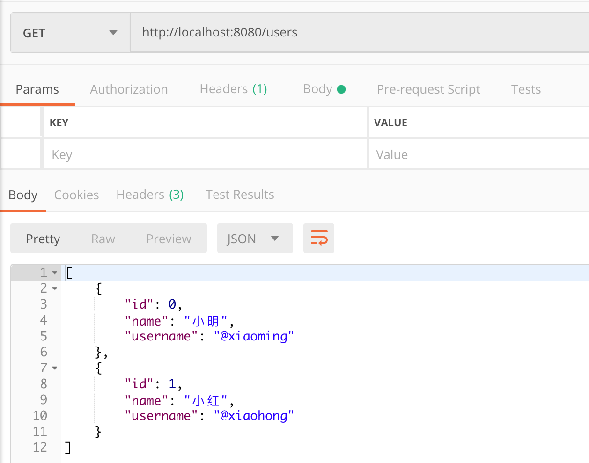

## Spring Data JDBC 练习

### 练习描述
- 编写UserRepository文件，完成所需接口
- 可使用postman对接口进行测试，如选择操作的结果为：

- 运行./gradlew test 通过所有测试

### 环境描述
- java8
- Intellij-IDEA

### 如何开始
- 克隆模版库,在UserRepository文件中下完成需求

### 输出规范
- 完成需求的代码
- 通过所有测试